# 2장. 도커의 기본적인 사용법

## 2.1 컨테이너로 hello world 실행하기

```shell
docker run diamol/ch02-hello-diamol
```

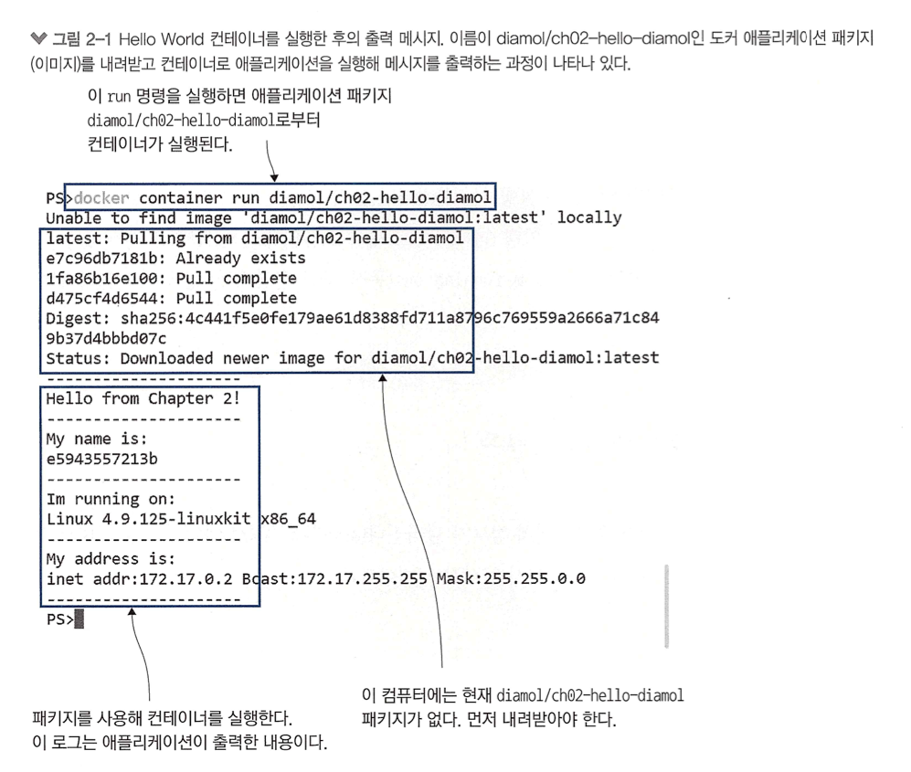

- `docker run` 명령은 컨테이너로 애플리케이션을 실행하라는 도커의 명령
    - 미리 도커로 실행하도록 패키징돼 누구나 내려받을 수 있도록 공유된 것
    - 컨테이너 패키지 (도커에서는 이를 **이미지** 라고 한다.)

- docker 이미지를 내려받는 것을 `pull` 이라고 한다.

도커의 핵심 워크 플로우

- 먼저 애플리케이션을 컨테이너에서 실행할 수 있도록 패키징하고,
- 다른 사람이 패키지를 사용할 수 있도록 공유한 다음,
- 이를 통해 내려받은 사람이 컨테이너를 통해 애플리케이션을 실행하는 것이다.

도커에서는 이 과정을  **빌드, 공유, 실행** 이라고 부른다.

## 2.2 컨테이너란 무엇인가?

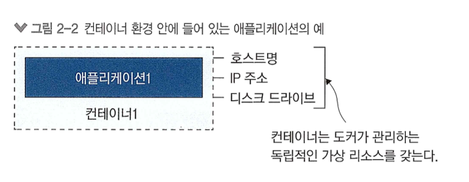
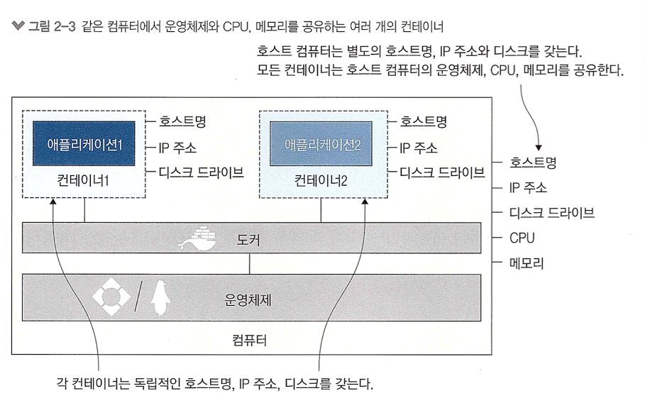

- 이러한 구도가 중요한 이유는 격리와 밀집 이라는 모순돼 보이는 조건을 동시에 만족시킬 수 있기 때문이다.
- 밀집이란 컴퓨터에 CPU 와 메모리가 허용하는 한 되도록 많은 수의 애플리케이션을 실행하는 것을 의미한다.
- 그러나 서로 다른 애플리케이션을 동시에 실행하는 데는 제약이 따른다.
    - 언어, 라이브러리 등등..

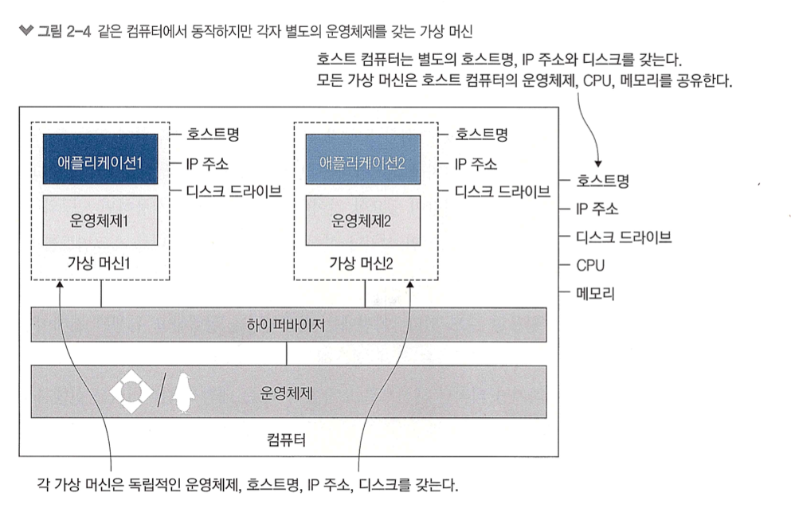

- 각각의 가상 머신은 자신만의 운영쳬제를 별도로 갖는다. 이 운영체제는 애플리케이션이 사용해야 할 CPU와 메모리 자원 상당량을 차지한다.
- (생략..) 결국 가상 머신은 격리는 달성할 수 있지만 밀집은 제공하지 못한다.

- 컨테이너는 이러한 단점을 해결할 수 있다.
- 각각의 컨테이너는 호스트 컴퓨터의 운영체제를 공유하므로 필요한 리소스가 크게 경감된다.
- 또한 컨테이너 역시 외부와 독립된 환경을 제공하므로 밀집과 격리가 동시에 달성되는 것이다.

## 2.3 컨터에너를 원격 컴퓨터처럼 사용하기

```shell
docker run --interactive --tty diamol/base
```

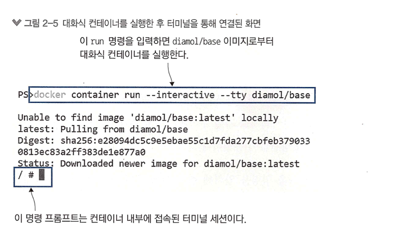
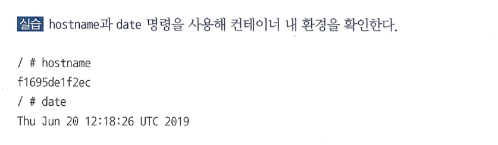
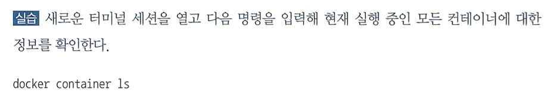
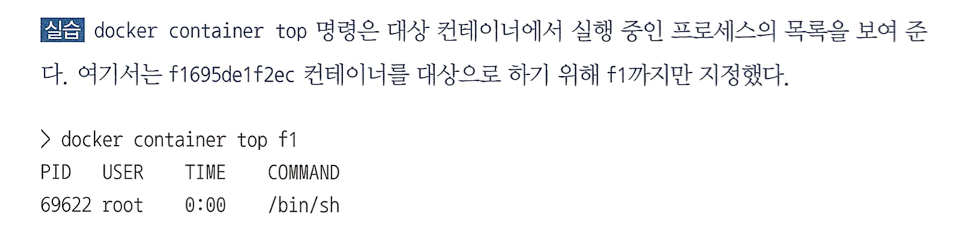
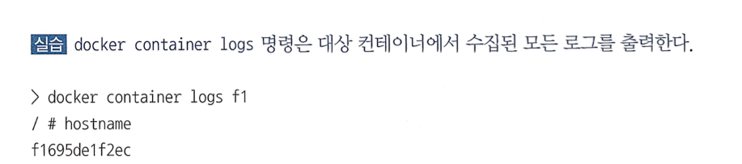
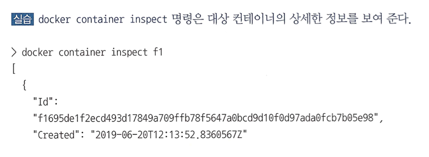

- 도커를 사용하는 한 컨테이너는 모두 똑같다.
- 도커를 적용하면 모든 애플리케이션 위에 관리를 위한 계층이 하나 추가된다.
    - 리눅스 컨테이너에서 동작하는 개발된 지 10년이 지난 자바 애플리케이션이나,
    - 윈도 컨테이너에서 동작하는 15년 된 닷넷 애플리케이션,
    - 라이브레이 파이 에서 동작하는 go 로 작성된 따끈따끈하 애플리케이션 모두 똑같은 방법으로 관리할 수 있다.

- `run` 명령으로 애플리케이션을 실행하고, `logs` 명령으로 로그를 출력하고, 프로세스 목록을 보려면 `top `명령을 실행하며, 컨테이너의 상세 정보를 보고 싶다면 `inspect` 명령을 사용하면 된다.

## 2.4 컨테이너를 사용해 웹 사이트 호스팅하기

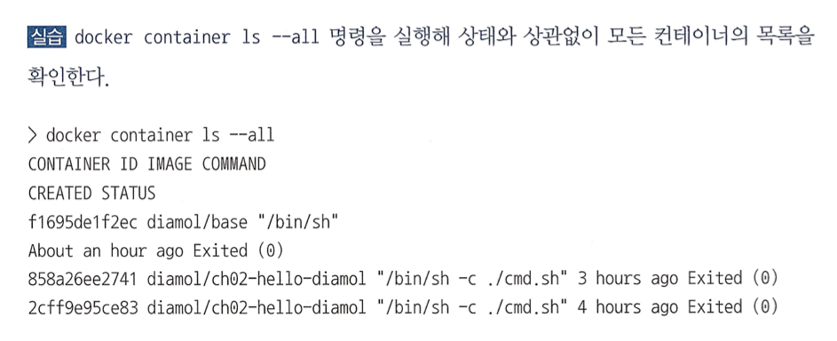

- 모든 컨테이너가 Existed 임.
    - 첫 번째는 컨테이너 내부 애플리케이션이 실행 중이어야 컨테이너의 상태도 실행 중이 된다는 점이다.
    - 두 번째는 컨테이너가 종료돼도 컨테이너는 사라지지 않는다.

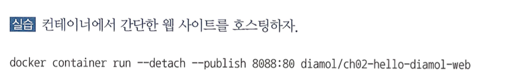
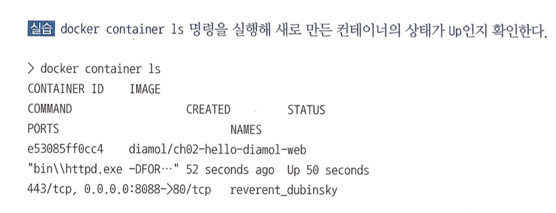

- --detach: 컨테이너를 백그라운드에서 실행하며 컨테이너 ID 를 출력한다.
    - detach 플래그를 적용해 실행한 컨테이너는 마치 리눅스의 데몬이나 윈도 서비스처럼 백그라운드로 동작하며 겉으로 드러나지 않는다.
- --publish : 컨테이너의 포트를 호스트 컴퓨터에 공개한다.
    - 도커를 설치하면 호스트 컴퓨터의 네트워크 계층에 도커가 끼어들게 되는데, 그러면 호스트 컴퓨터에서 들고나는 네트워크 트래픽을 모두 도커가 가로채서 그중 필요한 것을 컨테이너에 전달할 수 있다.

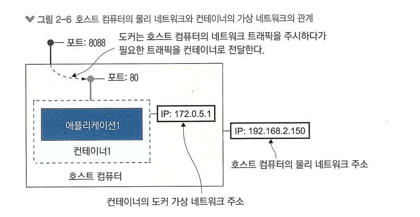
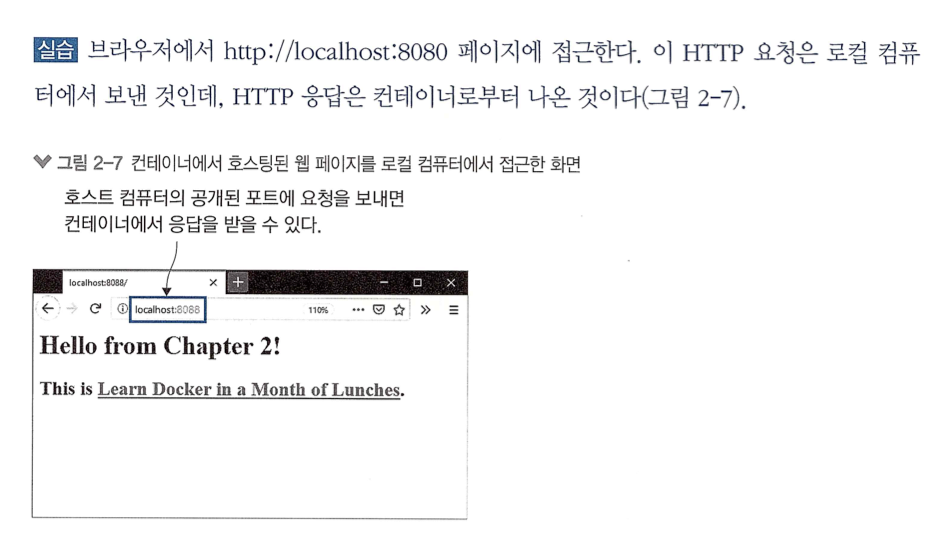
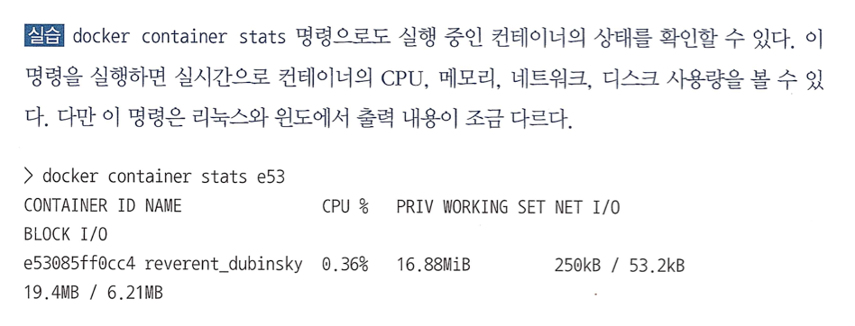
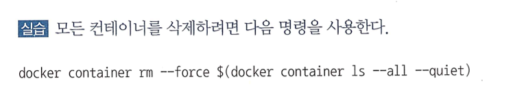

```shell
docker container rm --force $(docker container ls --all --quiet)
```

## 2.5 도커가 컨테이너를 실행하는 원리

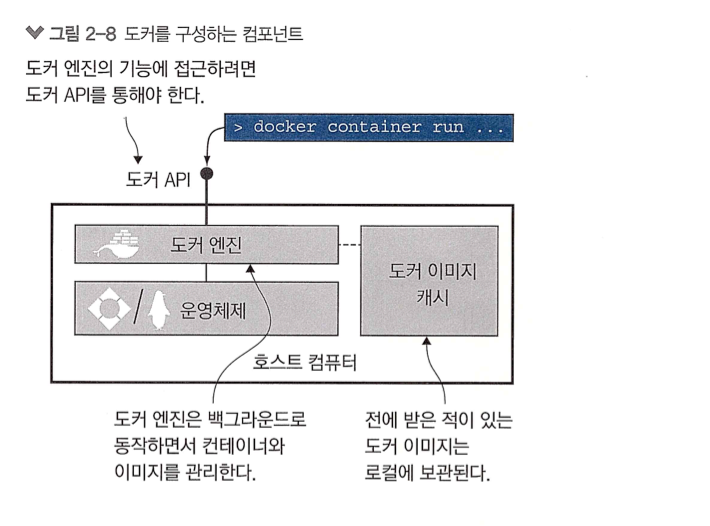

- 도커 엔진
    - 도커의 관리 기능을 맡는 컴포넌트
    - 이미지 관리 (캐시)
    - 도커 리소스

- 도커 엔진은 도커 API 를 통해 맡은 기능을 수행한다.
  - docker api 는 표준 HTTP 기반 REST APi 이다. 
  - 이 api를 네트워크를 경유해 외부 컴퓨터로부터 호출할 수 없도록 차단(기본 설정) 하거나 허용할 수 없다.

- 도커 명령행 인터페이스는 도커 API 클라이언트다.

