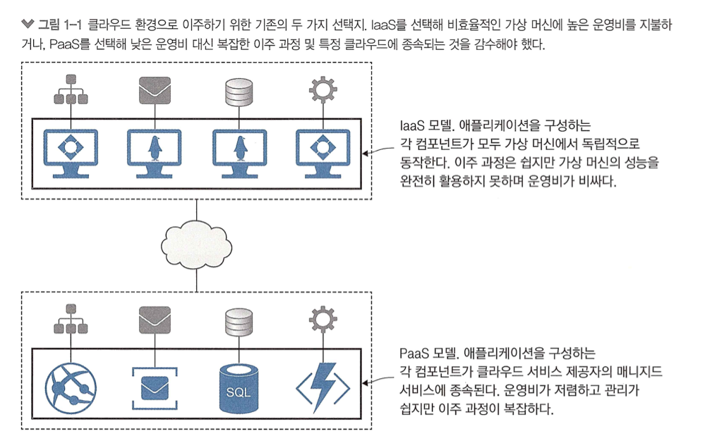
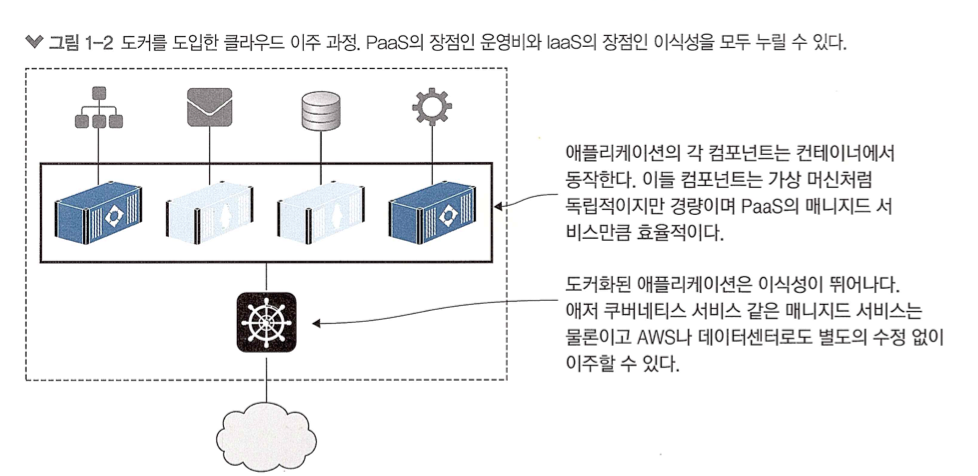
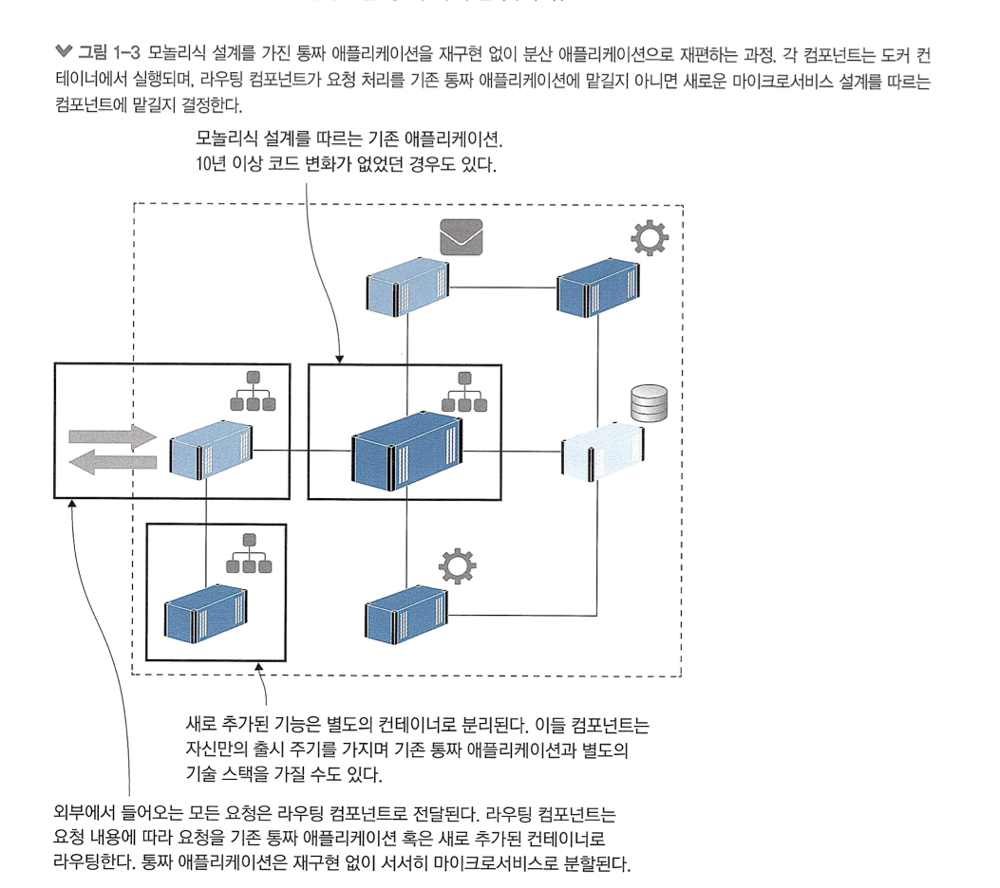
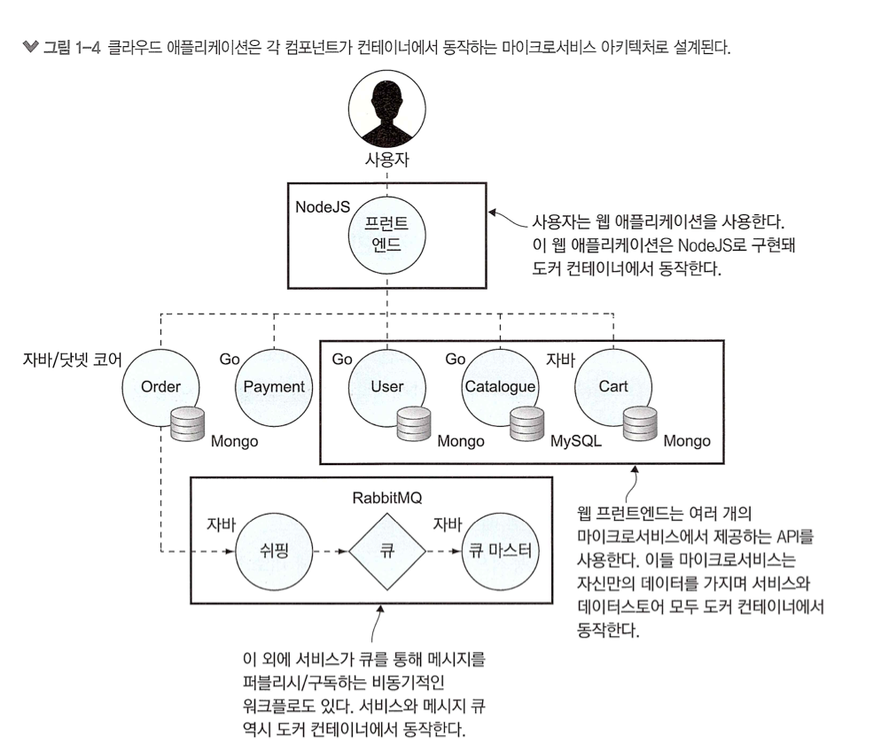
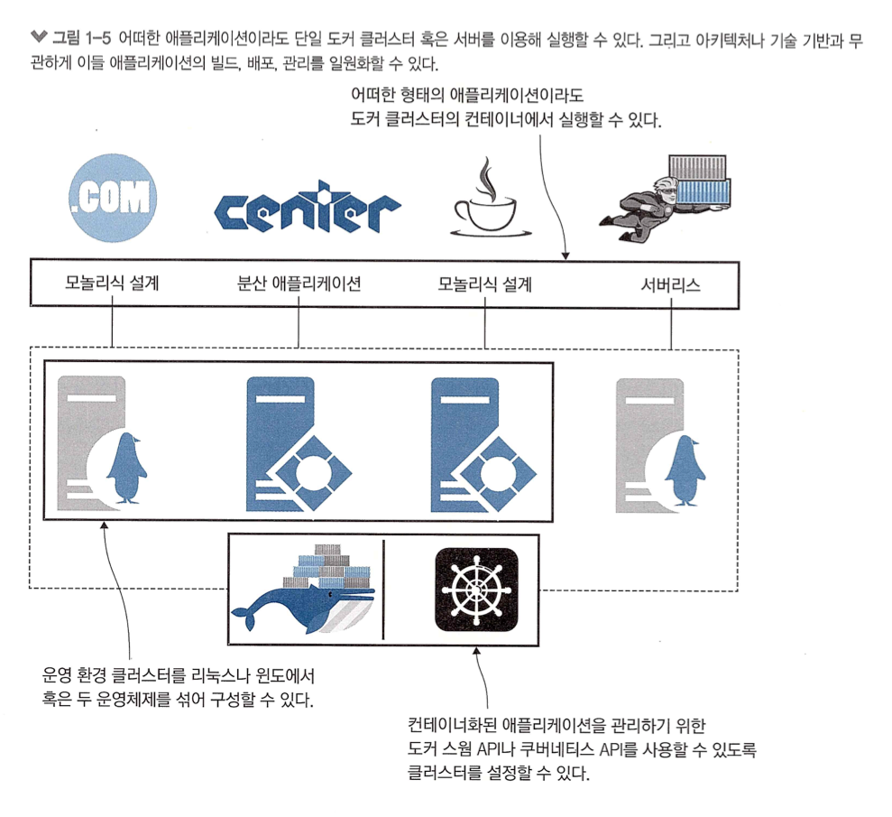

# 1장. 시작하기 전에

## 1.1 컨테이너가 IT 세상을 점령한 이유

## 1.1.1 클라우드 환경으로 이주하기

### 1.1.2 레거시 애플리케이션 현대화하기

도커를 도입하면 레거시 애플리케이션의 설계를 쉽게 현대화 할 수 있다.

### 1.1.3 클라우드 환경에 적합한 새로운 애플리케이션 개발하기ㅏ

- 도커는 분산 애플리케이션이든 모들로식 설계든 기존 애플리케이션을 클라우드로 이주하는 데 유용하다.

### 1.1.4 기술 혁신: 서버리스와 그 너머

### 1.1.5 데브옵스 도입하기

- 기술 조직은 '개발 팀' 과 '운영 팀'으로 나뉘고 서로의 책임을 미루게 되기 쉽다.
- 데브옵스는 개발과 운영을 합친 단어로 애플리케이션의 전체 생애주기를 담당한다.

## 1.2 대상 독자

(생략)

## 1.3 실습 환경 구축하기 
(생략)

 