# 3장 도커 이미지 만들기

## 3.1 도커 허브에 공유된 이미지 사용하기

```shell
docker image pull diamol/ch03-web-ping 
```

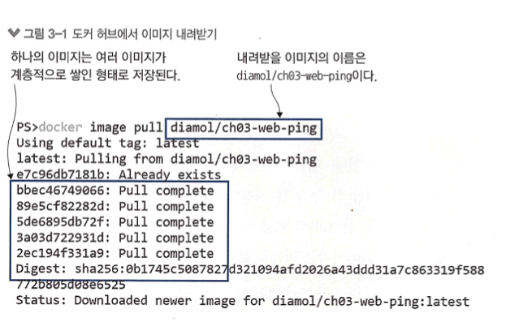

- 이미지를 내려받는 과정을 보면 여러 건의 파일을 동시에 내려받는다는 점에서 단일 파일을 내려받는 과정이 아니라는 것을 알 수 있다.
- 이들 각각의 파일을 이미지 레이어라고 부른다.
- 도커는 물리적으로 여러 개의 작은 파일로 구성돼 있다.
- 도커는 이들 파일을 조립해 컨테이너의 내부 파일 시스템을 만든다.

```shell
docker container run -d --name web-ping diamol/ch03-web-ping 
```

- --name 은 컨테이너에 원하는 이름을 붙이고 이 이름으로 컨테이너를 지칭할 수 있다.

> containerID, image , names 를 햇갈리지 말자

```shell
docker container logs web-ping
```

> docker container logs {containerID | names} # 둘다 가능함

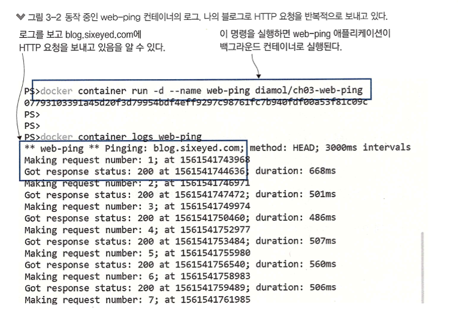

- 환경 변수는 운영체제에서 제공하는 키-값 쌍이다.
- 도커 컨테이너도 별도의 환경 변수를 가질 수 있다. 그러나 이 환경변수는 운영체제의 것을 가져오는 게 아니라 컨테이너의 호스트명이나 IP 주소처럼 도커가 부여해준다.

```shell
docker rm -f web-ping
docker container run --env TARGET=google.com diamol/ch03-web-ping
```

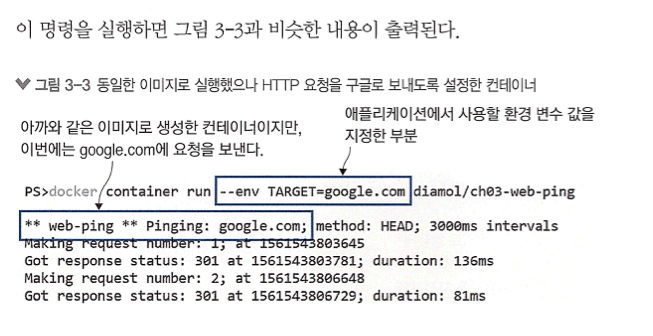

- 도커 이미지는 설정값의 기본값을 포험해 패키징되지만, 컨테이너를 실행할 때 이 설정값을 바꿀 수 있다.

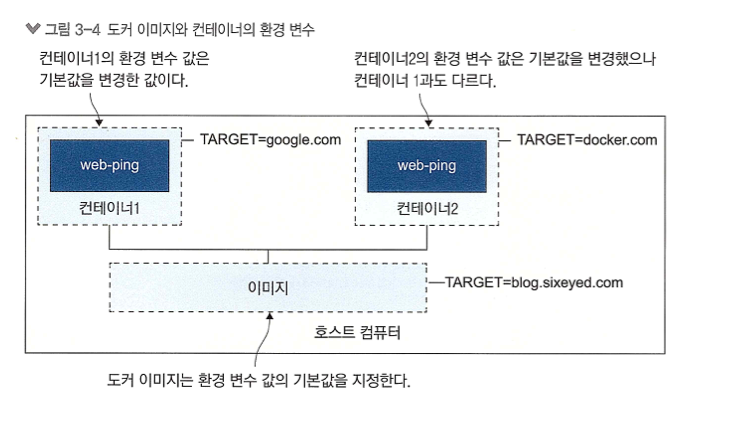

## 3.2 Dockerfile 작성하기

```dockerfile
FROM diamol/node

ENV TARGET="blog.sixeyed.com"
ENV METHOD="HEAD"
ENV INTERVAL="3000"

WORKDIR /web-ping
COPY app.js .

CMD ["node", "/web-ping/app.js"]
```

- FROM : 모든 이미지는 다른 이미지로부터 출발한다. diamol/node 이미지에는 web-ping 애플리케이션을 실행하는 데 필요한 런타임 Node.js 가 설치돼 있다.

- ENV : 환경 변수 값을 지정하기 위한 인스트럭션이다. 값을 저장하기 위해 키-벨류 형식을 따른다. 이 스크립트에는 env 인스트런션이 세 번 사용돼 세 개의 환경 변수를 설정했다.

- WORKDIR : 컨테이너 이미지 파일 시스템에 디렉터리를 만들고, 해당 디렉터리를 작업 디레터리로 지정하는 인스트럭션이다. 그러므로 스크립트에 나온 인스트럭션은 리눅스 컨테이너에서는 /web-ping 디렉터를
  만든다.

- COPY : 로컬 파일 시스템의 파일 혹은 디렉터리를 컨테이너 이미지를 복사하는 인트스트럭션이다. [원본경로] [복사경로] 형식으로 지정하면 된다.

- CMD : 도커가 이미지로부터 컨테이너를 실행했을 때 실행할 명령을 지정하는 인스트럭션이다. 여기서는 Node.js 런타임 애플리케이션을 시작하도록 app.js 를 저정했다.

## 3.3 컨테이너 이미지 빌드하기

```shell
docker image build --tag web-ping .
```

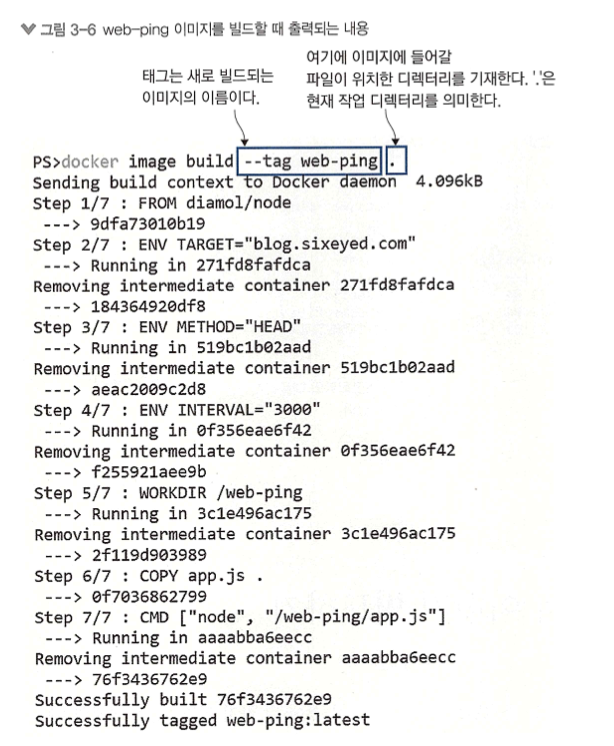

- --tag web-ping : 태그는 새로 빌드되는 이름

> ` --name `: docker container 의 이름,  `--tag` 는 image 의 이름

```shell
# 'w' 로 시작하는 태그명을 가진 이미리 목록을 확인 

docker image ls 'w*'
```

```shell
# 새로 빌드한 이미지로부터 컨테이너를 실행해 도커 웹 사이트에 5초마다 요청을 보내보자.

docker run -e target=docker.com -e interval=5000 web-ping
```

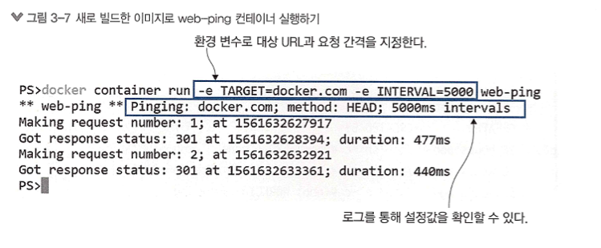

## 3.4 도커 이미지와 이미지 레이어 이해하기

```shell
# web-ping 이미지 히스토리 확인하기 

docker image history web-ping
```

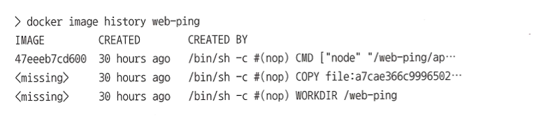

- 도커 이미지는 이미지 레이어가 모인 논리적인 대상이다.

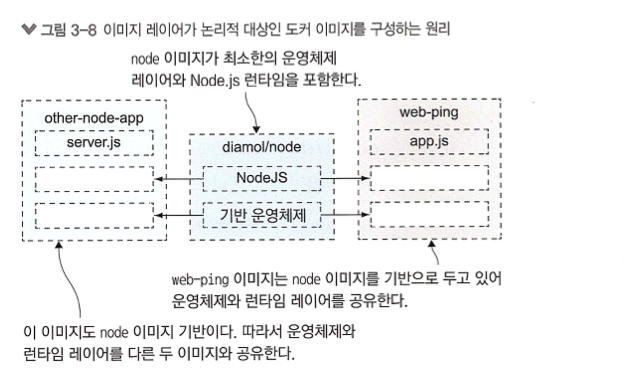

```shell
# 이미지 목록에서 각 이미지의 용량을 확인할 수 있다.
docker image ls 
```

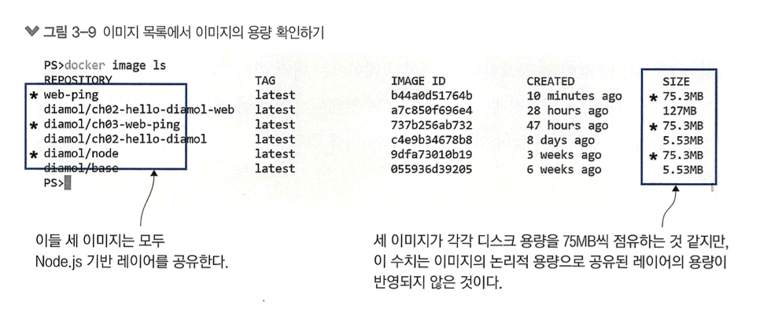

- 언뜻 보면 `diamol/node`, 도커 허브에서 내려받은 `diamol/ch-web-ping`, 그리고 새로 빌드한 `web-ping`까지 세 이미지가 모두 비슷한 용량을 점유하는 것 처럼 보인다.
- 하지만 이는 사실이 아니다. 이미지 목록의 size 항목에 나오는 수치는 이미지의 논리적 용량이지 해당 이미지가 실제로 차지하는 디스크 용량을 나타내는 것이 아니다.
- 다른 이미지와 레이어를 공유하면 여기에 나온 수치보다 디스크 용량을 훨씬 덜 차지한다.
- 이미지 목록 확인에서는 이를 확인할 수 없지만, 다른 명령으로 확인할 수 있다.

```shell
# 이미지 목록에서는 이미지의 용량 총합이 363.96MB로 나온다. 그러나 이 수치는 논리적 용량이다. 이미지 저장에 실제 사용된 디스크 용량은 system df 명령으로 확인할 수 았다.
docker system df
```

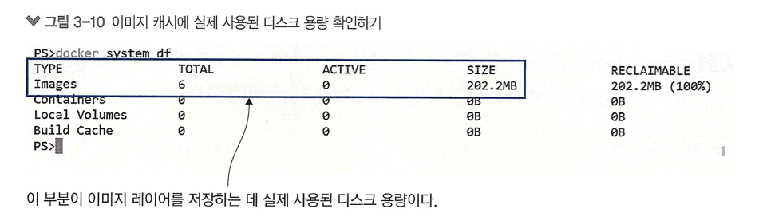

- 이 명령을 입력해 나온 출력 결과를 보면 이미지 캐시의 질제 용량은 약 202.2MB 를 차지하는 것으로 나온다.
- 이렇게 절약되는 디스크 공간은 대개 런타임 등 같은 기반 레이어를 공유하는 애플리케이션 숫자가 많을수록 더욱 늘어난다.
- 이미지 레이어를 여러 이미지가 공유한다면, 공유되는 레이어는 수정할 수 없어야 한다.
- 도커는 이미지의 레이어를 읽기 전용으로 만들어 두어 이런 문제를 방지한다.

## 3.5 이미지 레이어 캐시를 이용한 Dockerfile 스크립트 최적화

우리가 조금 전에 빌드한 web-ping 이미지에는 애플리케이션이 구현된 자바스크립트 파일이 들어있다.
이 파일을 수정하고 이미지를 다시 빌드하면, 새로운 이미지 레이어가 생긴다. 도커 이미지 레이어가 특정한 순서대로만 배치된다고 가정한다.
그래서 이 순서 중간에 있는 레이어가 변경되면 변경된 레이어보다 위에 오는 레이어를 재사용할 수 없다.

```shell
docker image build -t web-ping:v2
```

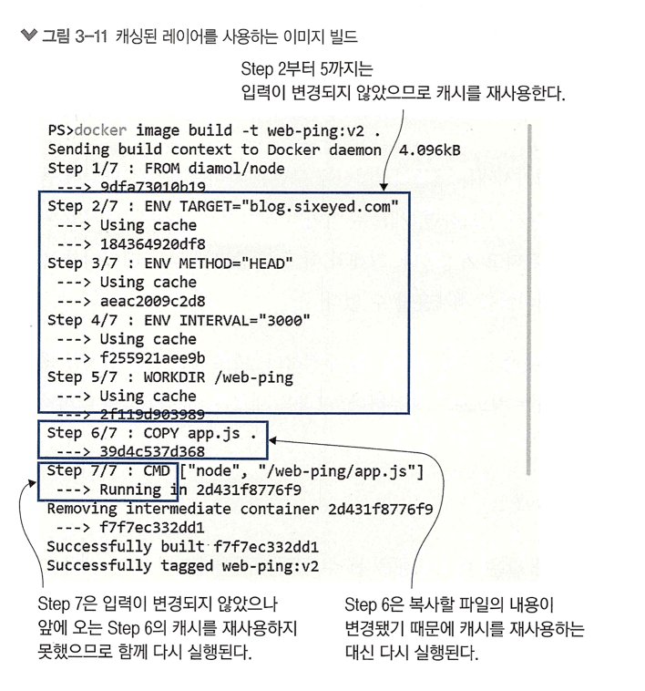

이미지를 빌드하면 두 번째부터 다섯 번째 단계까지는 기존의 캐시된 레이어가 재사용된다.
dockerfile 스크립트의 인스트럭션은 각각 하나의 이미지 레이어와 1:1로 연결된다.
그러나 인스트럭션의 결과가 이전 빌디와 같다면, 이전에 캐시된 레이어를 재사용한다.
이런 방법으로 똑같은 인스트럭션을 다시 실행하는 낭비를 줄일 수 있다.

도커는 캐시에 일치하는 레이어가 있는지 확인하기 위해 해시값을 이용한다.
해시는 입력값이 같은지 확인할 수 있는 일종의 디지털 지문이다. 해시값은 Dockerfile 스크립트의 인스트럭션과
인스트럭션에 의해 복사되는 파일의 내용으로부터 계산되는데, 기존 이미지 레이어에 해시값이 이치하는 것이 없다면 캐시 미스가 발생하고 해당 인스트럭션이 실행된다.
한 번 인스트력션이 실행되면 그 다음에 오는 인스트럭션은 수정된 것이 없더라도 모두 실행된다.

우리가 만들었던 자그미한 이미지도 이에 영향을 받울 수 있다.

이러한 연유로 Dockerfile 스크립트의 인스트럭션은 잘 수정하지 않는 인스트럭션이 앞으로 오고 자주 수정되는 인스트럭션이 뒤에 오도록 배치돼야 한다.

> 인스트럭션이란 도커 파일안에서 실행되는 명령어를 의미하는 듯

이렇게 해야 캐시에 저장된 이미지 레이어를 되도록 많이 재용할 수 있다. 이미지를 공유하는 과정에서 시간은 물론이고 디스크 용량, 네트워크 대역폭을 모두 절약할 수 있는 방법이다.

> docker image 가 git 과 유사한 점이 있는 것 같다. 자주 변경되지 않는 부분을 최대한 위쪽으로 공통화 해야 한다.

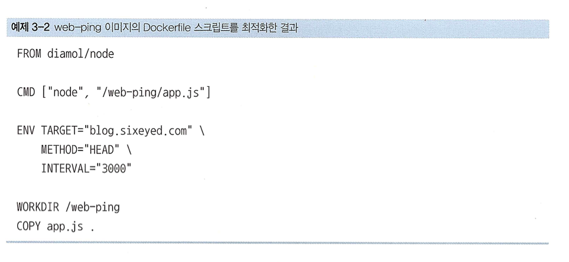

- 짧은 스크립트지만 개선의 여지가 있다. 
- CM 인스트럭션은 스크립트 마지막에 위치할 필요가 없다. 이 인스트럭션은 from 뒤라면 어디에 배치해도 무방한다. 또한 수정할 일이 잘 없을 것이므로 초반부에 배치하면 된다.

- app.js 수정하고 이미지를 빌드해 보면, 마지막 단계를 제외하고 모든 레이어를 캐시에서 재사용한다. 우리가 원하는 최적화가 바로 이것아디.


 


