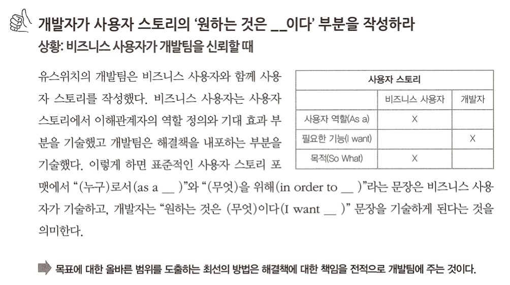

# 05. 목표에서 범위 도출하기

- 범위 정의는 올바른 소프트웨어를 구축하는 프로세스에서 중요한 역할을 수행한다.
- 앞으로

## 올바른 범위 설정하기

- 맨먼스 미신: 소프트웨어 시스템을 만들 때 가장 어려운 일은 무엇을 만드는 것인지 결정하는 일이다.
- 알베르트 아인슈타인: 어떤 문제를 명확하게 서술하는 것이 때로는 그 문제의 해법보다 더 중요하다.

> 사람들이 필요하다는 것을 말할 때 그들에게 "왜" 라는 질문을 던져서 그들의 새로운 암시적 목표를 파악할 수 있습니다.
> 대부분의 조적은 자신들의 비즈니스 목표를 명확하게 기술하지 못합니다.
> 어찌됐던 목표를 도출해 냈다면 역으로 파악한 목표에서 범위를 도출해야 하고, 초기에 가정했던 범위를 버릴 수 있습니다.

### "왜" 와 "누구" 를 이해하라

- 사용자 스토리는 일반적으로 세 부분으로 구성된다 "나는 __ 로서 __ 을 하기 위해 __ 을 원한다."

> 어떤 것이 필요한 이유와 그것을 필요로 하는 사람이 누구인지 이해하는 것은 제시된 해결책을 평가하는 데 핵심적인 요소다.

(누구와 왜을 이용하여 시간과 비용이 많이 드는 해결책을 구현하는 대신, 간단한 해결책을 사용하여 시간과 돈을 획기적으로 줄인 이야기 )

- 가능한 사용자 스토리나 유스 케이스를 다루거나 작업의 명세를 논의하지 않고 진행하면, 누군가가 웹 애플리케이션을 제한한 것이 하나의 해결책으로 간주된다.

### 어디서 가치가 장출되는지 이해하라

어디서 가치라 창출되는지 이해하면 더 나은 해결책을 설계하는 데 도움이될뿐더러 우선순위를 정하는 데도 큰 도움이 된다.

### 비즈니스 사용자가 기대하는 결과를 이해하라

- 목표를 확정하기 어려운 상황이라면 시스템이 기대하는 바가 무엇인지를 생각해보는 것으로 시작해도 좋다.
- 즉 왜 그들이 그것을 필요로하며, 어떻게 소프트웨어가 그것을 제공할 수 있는지를 조사한다.
- 시스템에 기대하는 바를 정의하면 거기서 도출된 요구사항을 만족시키는 데 집중할 수 있다.
- 그 기능이 필요한 이유를 분석하면 프로젝트의 목표를 도출해낼 수 있다.

### 개발자가 사용자의 스토리의 '원하는 것은 __이다.' 부분을 작성하라

## 상위 수준의 권한 없이 범위에 대해 협업하기

### 어디에 유용한 것인지 질문하라

...(생략) 그들은 작업을 미루고 실제 요구사항을 얻을 수 있었다.
개발팀은 계층 구조의 성능을 개선하는 대신 비즈니스 사용자의 계산 과정을 자동화햇다.
그 결과 계산은 즉시 이뤄졌고 오류가 발생할 가능성이 대폭 감소했다.
이 해결책으로 더 나은 결과를 얻을 수 있었고 원래 요구사항을 만족시키는 것보다 비용도 적게 들었다.

> 기술적인 기능 명세를 사용하는 대신 그 기능이 어디에 유용한지 상위 수준의 예를 요청해야 한다. 그러면 실제 문제를 알 수 있다.

### 다른 해결책에 대해 질문하라

> 비즈니스 관점에서 추가 선택지를 찾는 좋은 전략은 대안을 묻는 것이다.

### 최하위 수준에서만 보지 마라

한 이터레이션에 적합하도록 출시 항목을 축소해야 할 필요성 때문에 많은 팀이 백로그에 있는 항목을 하위 수준으로 낮춘다.
이렇게 하면 작업 프로세스 흐름에는 도움이 되지만, 자칫 팀이 큰 그림을 놓칠 수도 있다.

> 프로세스로서 예제를 활용한 명세는 상위 수준과 사위 수준의 스토리를 모두 다룬다.
> 어떻게 그것이 유용한지를 보여주는 상위 수준의 예제를 가지고 있으면 상위 수준의 명세를 수집할 수 있다.
> 이러한 상위 수준의 에제가 있으면 인도해야 할 기능을 객관적으로 측정할 수 있다.

큰 사용자 스토리를 출시 가능한 작은 단위로 나누는 것은 좋은 실천법이다.
하지만 개발이 완료되는 시점을 알기 위해 상위 수준의 스토리는 여진히 필요하다.
두 가지 수준을 모두 보려면 평면적이고 직선적인 백로그 대신 계층적인 백로그가 필요하다.

하위 수준의 명세와 테스트는 출시한 부분의 논리가 정확한지 알려주며 상위 수준의 인스 테스트는 각 부분이 함께 잘 작동하는지 알려준다.

### 팀이 완전한 기능을 출시하게 하라.

> 개발팀이 완전한 기능 단위로 개발하게 되면 범위를 계획하고 뭉서이 필요한지 결정하는 데 비즈니스 사용자를 좀 더 깊이 참여 시킬 수 있다.
> 이는 개발자가 비즈니스 사용자와 함께 기능에 대해 토론할 수 있기 때문이다.

프로젝트 범위에 대한 상위 수준의 권한이 없더라도 개발팀은 개발 범위에 대해 다음과 같은 방법으로 영향을 줄 수 있다.

- 요구 사항에 대한 적극적인 문제 제기
- 실제 비즈니스 목표의 이해
- 기능을 누가, 왜 필요로 하는지 이해

## 추가 정보

- 사용자 스토리 매핑 (user story mapping) : 거시적 관점을 제공하는 사용자 스토리를 위한 계층적 매핑 기법

## 정리

- 요구사항을 받았다면 일단 적업을 미뤄두고 실제 문제를 이해하는 데 필요한 정보를 모으고 협력적으로 해결책을 설계한다.
- 작업을 피할 수 없다면 어떻게 그것들이 유용한지에 대해 상위 수준의 예제를 요청한다. 그러면 누가, 왜 그것을 필요홀 하는지 이해할 수 있게 되어 그에 대한 해결책을 만들 수 있다.
- 적절한 범위를 도출하라면 마일스톤의 비즈니스 목표와 마일스톤에 기여하거나 영향을 받는 이해관계자를 고려한다.
- 비즈니스 사용자가 더 관심을 갖는 비즈니스 결과부터 시작한다.
- 개발팀이 완결성 있는 기능 단위로 개발할 수 있게 팀을 재구성한다.
- 목표에서 범위를 효과적으로 도출하기 위해 기능 주입, 사용자 스토리 매핑, 효과 매핑을 비롯한 최신 기법을 조사한다.

