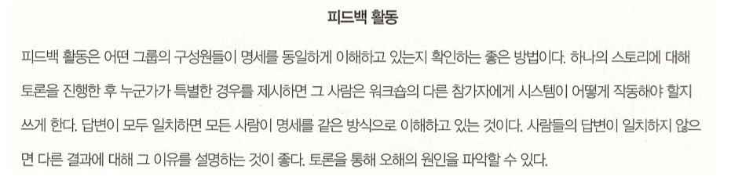
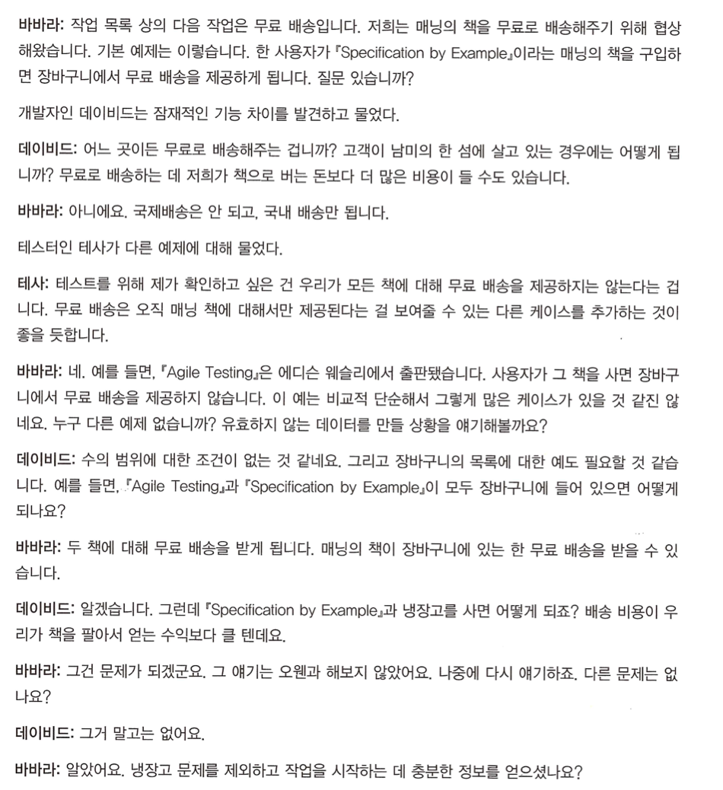
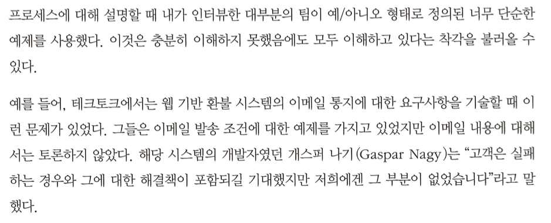

# 07. 예제를 활용해 설명하기

- 예제는 모호함을 방지하고 정확하게 의사소통할 수 있는 좋은 방법이다.
- 예제는 의사소통 문제를 방지하는 좋은 도구다.

## 예제를 활용해 설명하기 : 예제

## 예제는 명확해야 한다

- 좋은 예제는 모호함을 방지한다. 그러자면 오해의 여지가 없어야 한다.
- 각 예제는 문맥을 정의하고 특정 상황에서 시스템이 어떻게 작동해야 하는지를 명확하게 정의해야 하며, 가능한 한 쉽게 확인할 수 있는 사항을 기술해야 한다.

### 예/아니오 형태로 정의되는 예제를 만들지 마라

상황: 기본 개념이 별도로 정의되지 않았을 경우

> 예/ 아니오롣 대답할 수 있는 예제에 주의를 기울이고 좀 더 명확하게 재작성한다.
> 예/ 아니오 의 대답이 나온다면, 예 일때는 어떤 작업이, 아니오 일때는 어떤 작업을 해야하는지 추가로 작성한다면 보완이 될까?

### 추상적인 동치분류를 사용하지 말라

상황: 구체적인 예제를 쓸 수 있는 경우

- '10 보다 작은' 과 같은 등치분류나 변수는 오해를 낳을 수 있다. 구체적인 예를 선정하지 않으면 다른 사람들은 음수가 포함되는지 여부를 오해할 수 있다.

> 동치분류 대신 항상 대표성이 있는 구체적인 예제를 사용한다.

## 예제는 완전해야 한다

### 데이터를 가지고 실험하라

> 완전하다고 생각하는 예제를 가지고 있다면 예제의 구조를 살펴보고 규칙을 깨

## 예제는 현실적이어야 한다

### 자신만의 데이터를 만들지 말라

상황: 데이터 기반 프로젝트의 경우

> 작은 변경과 불일치에더 큰 변화가 있을 수 있으므로 데이터 기반 프로젝트에서 실제 데이터를 사용하는 것은 중요하다.

### 고객으로부터 직접 기존 예제를 얻어라

상황: 기업 고객과 함께 일할 경우

> 명세를 기술하는 데 사용된 예제가 현실성을 띠게 하라. 대체로 현실적인 예제는 고객이 준 데이터를 포함하고 있다.

## 예제는 이해하기 쉬워야 한다

### 가능한 모든 조합을 다루려는 유혹에 빠지지 마라

> 예제를 활용해 설명하려고 할 때 토론을 이끌어갈 수 있고 이해를 증진시킬 수 있는 예제를 찾아라.

### 암시적인 개념을 찾아라

> 에제를 살펴보고 거기에 숨겨진 개념을 찾알. 그 개념을 명확하게 하고 개벌적으로 정의한다. 이러첨 예제를 재구성하면 명세를 이해하는 데 도움이될 뿐더라 더 나은 소프트웨어 설계를 이끌어 낼 수 있다.

## 비기능 요구사항 기술하기

### 더 정밀한 성능 요구사항을 확보하라

상황: 성능이 중요한 특징인 경우
> "현재 시스템 보다 빠르게" 와 같은 표현은 좋은 성능 요구사항이 아니다. 정확하게 얼마나 빨라야 하는지 이야기 해야 한다.

### UI에 대해 저수준 프로토타입을 사용하라

> 백엔드 처리에 대해 논의하는 대신 사용자 인터페이스 예제로 논의하면 사전에 좀 더 구체적인 정보를 얻을 수 있다.

### 참조 예제를 만들어라

상황: 요구사항을 정량화 할 수 없는 경우

## 정리

- 개발과 테스트에 일관되게 명세를 설명하는 공통의 예제를 사용할 수 있다면 무엇을 만들어야 하는가에 대해 모든 사람들이 똑같이 이해하게 될 것이다.
- 기능을 설명하는 데 사용되는 예제는 명확하고 완전해야 하며, 현실적이고 이해하기도 쉬어야 한다.
- 현실적인 예제를 이용하면 불일치와 기능 차이를 구현하기 전에 발견할 수 있다.
- 초기 예제를 만들면 데이터로 실험해보고 기능이 명세를 만족하는지 테스트할 수 있는 대안을 찾아보라.
- 예제가 복잡하고 너무 많거나, 너무 많은 요소가 나타난다면 놓치고 있는 개념을 찾아보고 좀 더 추상적인 수준에서 예제를 해석해보라. 그리고 새로운 개념을 개별적으로 설명할 때는 각 개념에 초점을 맞춘 예제를
  사용한다.

