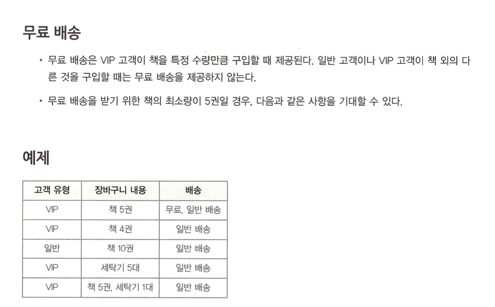
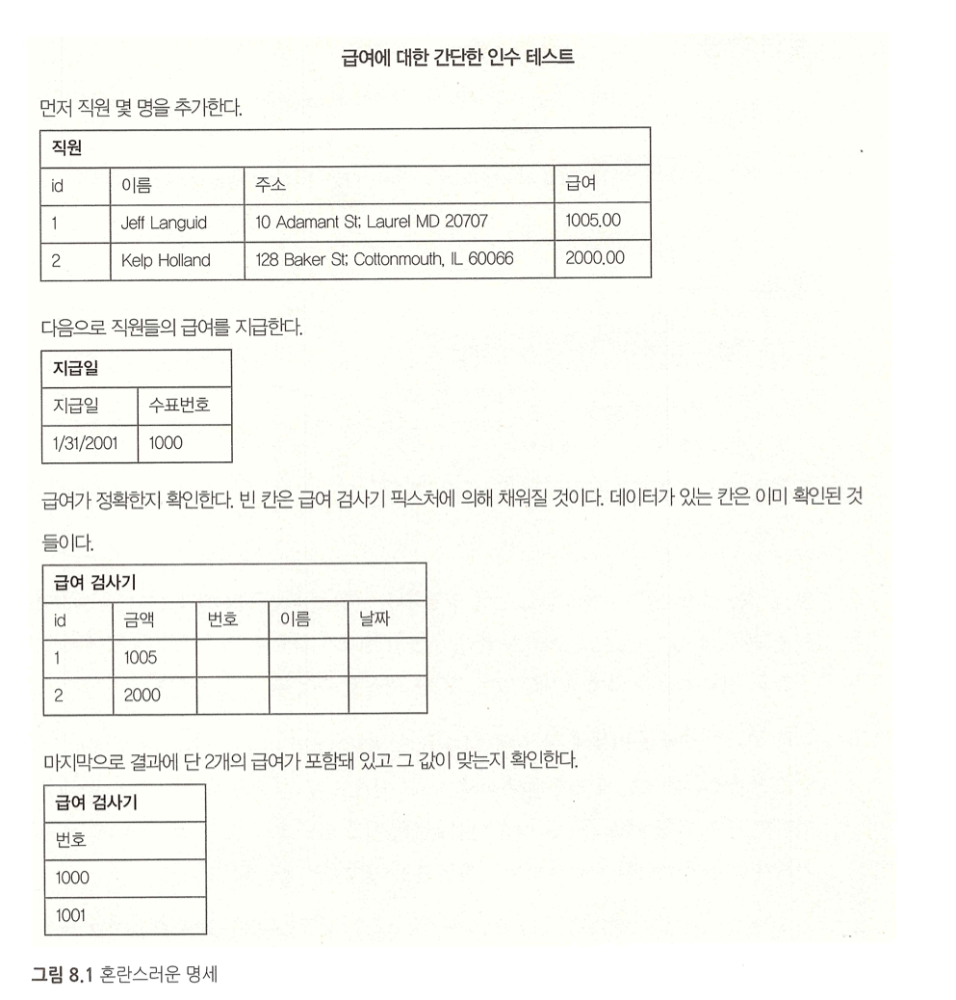
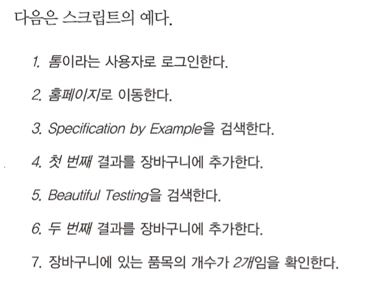
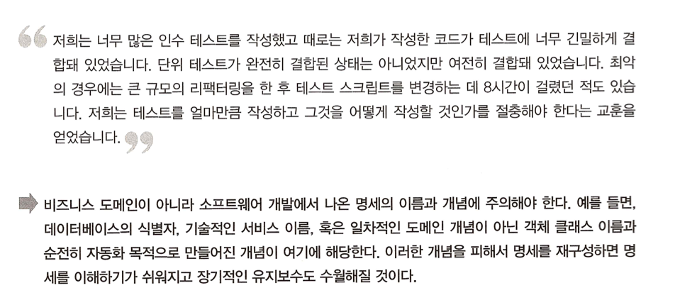

# 08. 명세 정제하기

성공적인 팀은 가공되지 않은 예제를 사용하지 않는다. 대신 예제에서 *명세를 정제한다.*

**예제를 활용한 명세에는** 완료조건, 기능에 대한 기대 결과, 그리고 인스 테스트가 담긴다.

> #### 예제가 포함된 명세는 인수 테스트다.

명세는 다음과 같은 조건을 만족시켜야 한다.

- 명확하고 테스트할 수 있어야 한다.
- 스크립트가 아닌 진짜 명세여야 한다.
- 소프트웨어 설계에 대한 것이 아니라 비즈니스 기능에 대한 것이여야 한다.

- 부연설명이 필요 없을 만큼 명확해야 한다.
- 한곳에 집중해야 한다.
- 도메인 언어로 기술돼야 한다.

## 좋은 명세의 예

## 나븐 명세의 예

- 이 문서는 급여와 관련이 되어 있자먼 정확하게 무엇을 설명하고 있는가?

## 명세를 정제할 때 중점을 둬야할 사항

### 예제는 명확하고 테스트할 수 있어야 한다.

- 개발 완료를 명백하게 확인할 수 있게 명세에서는 결과를 객관적으로 측정할 수 있어야 한다.
- 그래서 명세에는 검증할 수 있는 정보(시스템을 체크할 수 있는 매개변수 조합과 기대 결과 등)를 포함해야 한다.

### 스크립트는 명세가 아니다.

### 흐름 위주의 설명을 피하라

> 시스템의 작동 방식에 대한 설명에 주의하라. 시스템이 무엇을 해야 하는지를 생각하라.

### 명세는 소프트웨어 설계가 아닌 비즈니스 기능에 대한 것이어야 한다.

이상적으로 명세는 소프트웨어 설계를 내포하지 않아야 한다. 명세는 소프트웨어가 어떻게 구현될 것인지를 규정하지 않고 비즈니스 기능을 설명해야 한다. 이것은 두 가지 목적에 부합니다.

- 명세는 개발자가 현재 최선의 해결책을 찾는 것을 가능하게 한다.
- 명세는 나중에 개발자가 설계를 개선하는 것을 가능케한다.

### 코드와 긴밀하게 결합된 명세를 작성하지 않는다.

> 코드와 긴밀하게 결합되거나 소프트웨어 구현을 반영하는 명세는 쉽게 깨지는 테스트를 만든다.

### 명세에서 기술적인 난관을 회피하려는 유혹에 맞서라
상황 : 레거시 시스템에서 작업하는 경우

### 사용자 인터페이스 세부사항에 매몰되지 마라
상황: 웹 프로젝트의 경우

> 예제를 활용한 명세를 시작할 때 많은 팀이 사용자 인터페이스의 사소한 세부사항에 대해 불필요한 에제를 

## 정제하기 연습

## 정리
